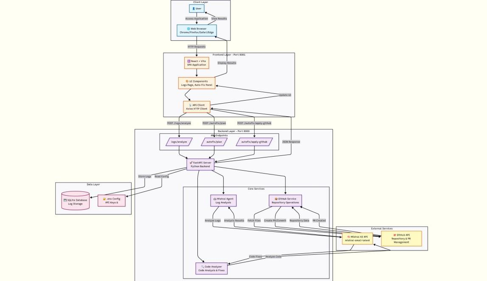
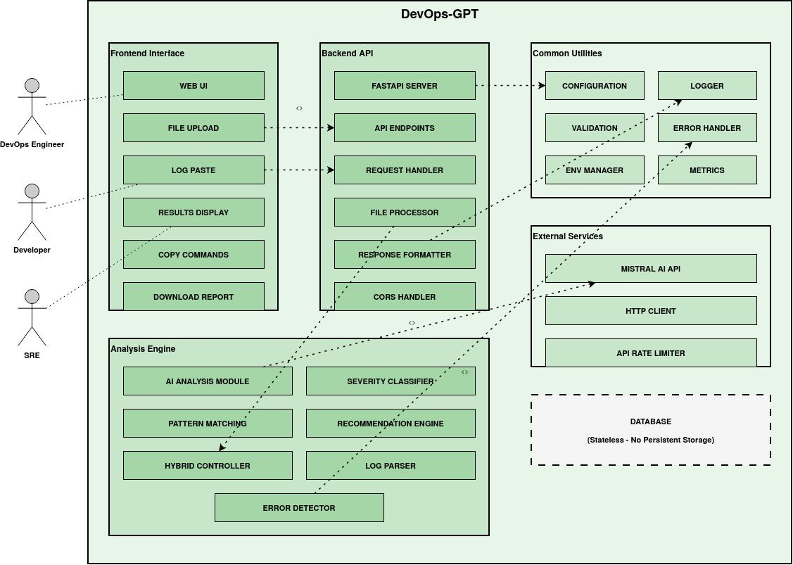
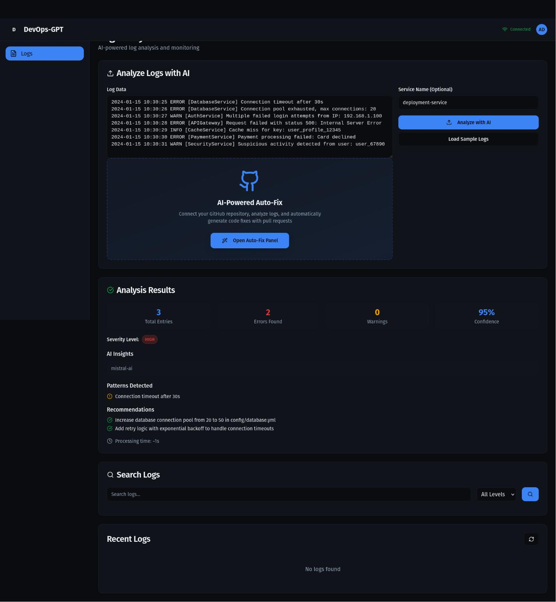

# DevOps-GPT: AI Powered Deployment and Failure Detection

DevOps-GPT is an AI-driven DevOps observability and deployment intelligence framework developed as a Final Year Project for intelligent CI/CD monitoring, deployment failure detection, anomaly analysis, and automated root-cause assistance using Large Language Models (LLMs) and the Model Context Protocol (MCP).

---

## Research Publication

Our research work was presented at **Nexus-2025 Conference**.

---

## Features

- AI-powered log analysis
- Deployment anomaly detection
- Real-time CI/CD monitoring
- Hybrid Regex + LLM analysis engine
- Root cause analysis using Generative AI
- Severity-based issue classification
- Automated remediation suggestions
- Cloud-native observability support
- FastAPI-based backend services
- Intelligent operational insights

---

## Tech Stack

### Frontend
- HTML5
- CSS3
- Tailwind CSS

### Backend
- FastAPI
- Python
- AsyncIO

### AI / ML
- OpenAI GPT / Mistral AI
- NLP-based Log Analysis
- Isolation Forest
- Hybrid AI + Regex Detection

### DevOps & Cloud
- Docker
- Kubernetes
- Terraform
- Jenkins
- GitHub Actions

### Monitoring & Observability
- Prometheus
- Grafana
- Model Context Protocol (MCP)

---

## System Architecture

---

## Package Diagram

---

## Dashboard Preview

---

## Project Documents

📄 [Research Paper](./DevOps%20GPT%20-%20for%20Failure%20and%20Deployment%20detection%20Anuj%20Deshmukh-2.pdf)

📘 [Final Year Thesis](./Final_year_thesis.pdf)

---

## Research Contributions

- Proposed a hybrid AI + Regex based DevOps analysis framework
- Integrated LLMs for contextual deployment diagnostics
- Designed a stateless log-analysis architecture
- Implemented intelligent severity classification
- Developed real-time operational monitoring workflows
- Improved deployment reliability through automated insights

---

## Results

- 94.5% severity classification accuracy
- 96.8% error detection accuracy
- 1–2 second pattern-based analysis
- Real-time operational diagnostics
- Reduced Mean Time To Detect (MTTD)
- Reduced Mean Time To Resolve (MTTR)

---

## Team Contribution

### Vedant Agrawal
- Backend Development
- FastAPI Integration
- Infrastructure & Deployment Setup
- Hybrid Analysis Engine Integration
- Severity Classification Modules
- Stateless Processing Architecture

### Anuj Deshmukh
- Model Development
- AI/ML Pipeline Design
- Dataset Preparation
- Root Cause Analysis System
- Hybrid Detection Framework

### Vighnesh Ise
- Frontend Development
- Dashboard Design
- API Integration
- Application Testing
- UI/UX Workflows

---

Department of Artificial Intelligence and Data Science  
KK Wagh Institute of Engineering Education and Research  
Nashik, Maharashtra, India
